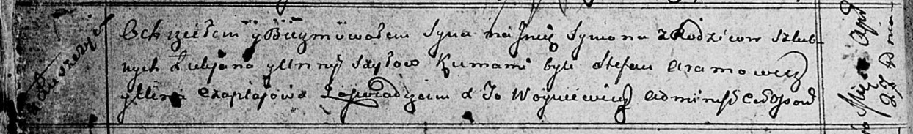

**Шило Сымон Лукьянов (Szyło Symon)**

27 апреля 1813 г -- крещение (НИАБ 136-13-894, лист 86об, №12/1812-р
(ориг)).

**НИАБ 136-13-894:** Лист 86об. **Метрическая запись №12/1813-р
(ориг).**

Осовская Покровская церковь. 27 апреля 1813 года. Метрическая запись о
крещении.

Szyło Symon -- сын родителей с деревни Лустичи.

Szyło Łukjan -- отец.

Szyłowa Anna -- мать.

Aramowicz Stefan -- кум.

Czaplajowa Elena? -- кума.

Woyniewicz Tomasz -- ксёндз.
