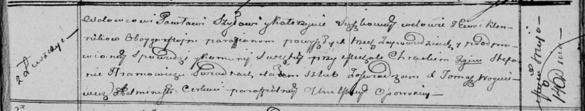

**Шило Павел (Szyło Paweł)**

14 мая 1814 г -- венчание с вдовой Катерыной Сушко с деревни Клинники
(НИАБ 136-13-920, лист 21, №4/1814-б (ориг)).

**НИАБ 136-13-920:** Лист 21. **Метрическая запись №4/1814-б (ориг).**

{width="6.496527777777778in"
height="1.245799431321085in"}

Осовская Покровская церковь. 14 мая 1814 года. Запись о венчании.

Szyło Paweł -- жених, вдовец, парафии Осовской, с деревни Лустичи.

Suszkowna Katerzyna -- невеста, вдова, парафии Осовской, с деревни
Клинники.

Chrocki Michał -- свидетель.

Chramowicz Stefan -- свидетель.

Woyniewicz Tomasz -- ксёндз.
