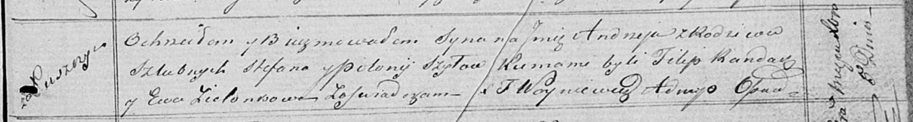

**Шило Андрей Стефанов (Szyło Andrzey)**

5 декабря 1820 г -- крещение (НИАБ 136-13-894, лист 105, №45/1820-р
(ориг)).

**НИАБ 136-13-894:** Лист 105. **Метрическая запись №45/1820-р (ориг).**

{width="6.496527777777778in"
height="0.8723272090988626in"}

Осовская Покровская церковь. 5 декабря 1820 года. Метрическая запись о
крещении.

Szyło Andrzey -- сын родителей с деревни Лустичи.

Szyło Stefan -- отец.

Szyłowa Połonija -- мать.

Randak Filip -- кум.

Zielonkowa Ewa -- кума.

Woyniewicz Tomasz -- ксёндз.
