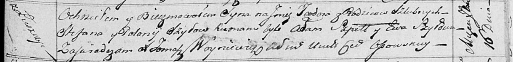

**Шило Стефан (Szyło Stefan)**

4 ноября 1815 г -- венчание с девкой Полонией Шило (НИАБ 136-13-920,
лист 22, №6/1815-б (ориг)).

8 октября 1816 г -- крещение сына Томаша (НИАБ 136-13-894, лист 94об,
№37/1816-р (ориг)).

16 сентября 1817 г -- крещение сына Тодора (НИАБ 136-13-894, лист 97,
№54/1817-р (ориг)).

5 декабря 1820 г -- крещение сына Андрея (НИАБ 136-13-894, лист 105,
№45/1820-р (ориг)).

27 июня 1821 г -- отпевание, умер в возрасте 40 лет (родился около 1781
г) (НИАБ 136-13-919, лист 35, №8/1821-у (ориг)).

**НИАБ 136-13-920:** Лист 22. **Метрическая запись №6/1815-б (ориг).**

{width="6.496527777777778in"
height="1.246469816272966in"}

Осовская Покровская церковь. 4 ноября 1815 года. Запись о венчании.

Szyło Stefan -- жених, молодой, парафии Осовской, с деревни Лустичи.

Szyłowna Połonija -- невеста, девка, парафии Осовской.

Cierach Stefan -- свидетель.

Brytka Stefan -- свидетель.

Woyniewicz Tomasz -- ксёндз.

**НИАБ 136-13-894:** Лист 94об. **Метрическая запись №37/1816-р
(ориг).**

{width="6.496527777777778in"
height="0.9206036745406824in"}

Осовская Покровская церковь. 8 октября 1816 года. Метрическая запись о
крещении.

Szyło Tomasz -- сын родителей с деревни Лустичи.

Szyło Stefan -- отец.

Szyłowa Polonija -- мать.

Szpet Stefan -- кум.

Szyłowa Ewa -- кума.

Woyniewicz Tomasz -- ксёндз.

**НИАБ 136-13-894:** Лист 97. **Метрическая запись №54/1817-р (ориг).**

{width="6.496527777777778in"
height="0.7938790463692038in"}

Осовская Покровская церковь. 16 сентября 1817 года. Метрическая запись о
крещении.

Szyło Teodor -- сын родителей с деревни Лустичи.

Szyło Stefan -- отец.

Szyłowa Połonija -- мать.

Szpet Adam -- кум.

Szyłowa Ewa -- кума.

Woyniewicz Tomasz -- ксёндз.

**НИАБ 136-13-894:** Лист 105. **Метрическая запись №45/1820-р (ориг).**

{width="6.496527777777778in"
height="0.8723272090988626in"}

Осовская Покровская церковь. 5 декабря 1820 года. Метрическая запись о
крещении.

Szyło Andrzey -- сын родителей с деревни Лустичи.

Szyło Stefan -- отец.

Szyłowa Połonija -- мать.

Randak Filip -- кум.

Zielonkowa Ewa -- кума.

Woyniewicz Tomasz -- ксёндз.

**НИАБ 136-13-919:** Лист 35. **Метрическая запись №8/1821-у (ориг).**

{width="6.496527777777778in"
height="1.8270833333333334in"}

Осовская униатская церковь. 27 июня 1821 года. Метрическая запись об
отпевании.

Szyło Stefan -- умерший, 40 лет, с деревни Лустичи, похоронен на
кладбище деревни Домашковичи.

Woyniewicz Tomasz -- ксёндз.
