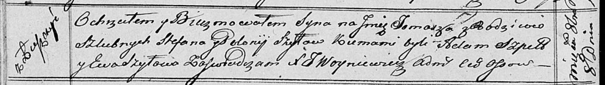

**Шило Томаш Стефанов (Szyło Tomasz)**

8 октября 1816 г -- крещение (НИАБ 136-13-894, лист 94об, №37/1816-р
(ориг)).

**НИАБ 136-13-894:** Лист 94об. **Метрическая запись №37/1816-р
(ориг).**

Осовская Покровская церковь. 8 октября 1816 года. Метрическая запись о
крещении.

Szyło Tomasz -- сын родителей с деревни Лустичи.

Szyło Stefan -- отец.

Szyłowa Polonija -- мать.

Szpet Stefan -- кум.

Szyłowa Ewa -- кума.

Woyniewicz Tomasz -- ксёндз.
