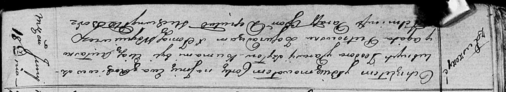

**Шило Ева Тодорова младшая (Szyłowna Ewa)**

18 июня 1816 г -- крещение (НИАБ 136-13-894, лист 93об, №17/1816-р
(ориг)).

**НИАБ 136-13-894:** Лист 93об. **Метрическая запись №17/1816-р
(ориг).**

{width="6.496527777777778in"
height="1.1934995625546807in"}

Осовская Покровская церковь. 18 июня 1816 года. Метрическая запись о
крещении.

Szyłowna Ewa -- дочь родителей с деревни Лустичи.

Szyło Teodor -- отец.

Szyłowa Parasia -- мать.

Aułasko Eliasz -- кум.

Pietrowska Agata -- кума.

Woyniewicz Tomasz -- ксёндз.
