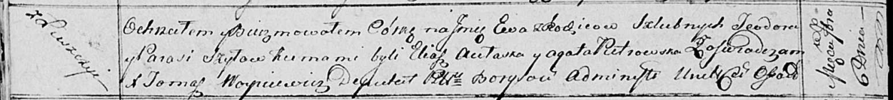

**Шило Ева Тодорова (Szyłowna Ewa)**

6 сентября 1814 г -- крещение (НИАБ 136-13-894, лист 90об, №52/1814-р
(ориг)).

**НИАБ 136-13-894:** Лист 90об. **Метрическая запись №52/1814-р
(ориг).**

Осовская Покровская церковь. 6 сентября 1814 года. Метрическая запись о
крещении.

Szyłowna Ewa -- дочь родителей с деревни Лустичи.

Szyło Teodor -- отец.

Szyłowa Parasia -- мать.

Aułaska Eliasz -- кум.

Pietrowska Agata -- кума.

Woyniewicz Tomasz -- ксёндз.
