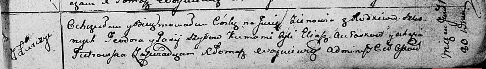

**Шило Зеновия Тодорова (Szyłowna Zienowia)**

30 января 1812 г -- крещение (НИАБ 136-13-894, лист 83, №7/1812-р
(ориг)).

**НИАБ 136-13-894:** Лист 83. **Метрическая запись №7/1812-р (ориг).**

{width="6.496527777777778in"
height="0.9266382327209098in"}

Осовская Покровская церковь. 30 января 1812 года. Метрическая запись о
крещении.

Szyłowna Zienowia -- дочь родителей с деревни Лустичи.

Szyło Teodor -- отец.

Szyłowa Paxia? -- мать.

Aułaskow Eliasz -- кум.

Pietrowska Ahafia -- кума.

Woyniewicz Tomasz -- ксёндз.
