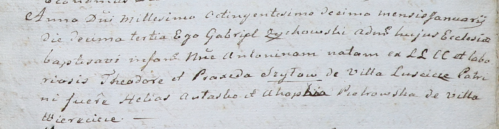

**Шило Антонина Тодорова (Szyłowna Antonina)**

13 января 1810 г -- крещение (НИАБ 937-4-32, лист 21, №4/1810-р).

**НИАБ 937-4-32:** Лист 21. **Метрическая запись №4/1810-р.**

Дедиловичский костел Наисвятейшего Сердца Иисуса. 13 января 1810 года.
Метрическая запись о крещении.

Szyło Antonina -- дочь крестьян с деревни Лустичи.

Szyło Theodor -- отец.

Szyłowa Praxeda -- мать.

Aułasko Helias -- крестный отец.

Pietrowska Ahaphia -- крестная мать, с деревни Веретей.

Zychowski Gabriel -- ксёндз.
