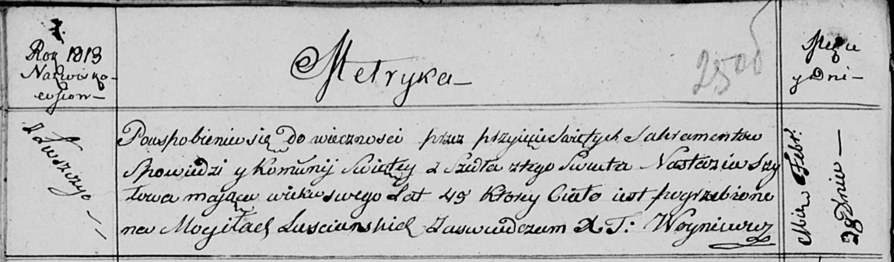

**Шило Настасья (Szyłowa Nastazia)**

28 февраля 1813 г -- отпевание, умерла в возрасте 49 лет (родилась около
1764 г) (НИАБ 136-13-919, лист 25об, №9/1813-у (ориг)).

**НИАБ 136-13-919:** Лист 25об. **Метрическая запись №9/1813-у (ориг).**

Осовская униатская церковь. 28 февраля 1813 года. Метрическая запись об
отпевании.

Szyłowa Nastazia -- умершая, 49 лет, с деревни Лустичи, похоронена на
кладбище деревни Лустичи.

Woyniewicz Tomasz -- ксёндз.
