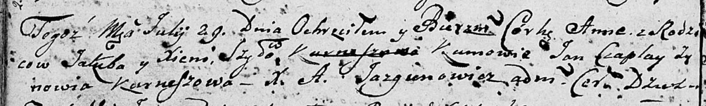

**Шило Анна Якубова (Szyłowna Anna)**

29 июля 1806 г -- крещение (НИАБ 136-13-894, лист 60об, №35/1806-р
(ориг)).

**НИАБ 136-13-894:** Лист 60об. **Метрическая запись №35/1806-р
(ориг).**

{width="6.496527777777778in"
height="0.9796084864391951in"}

Дедиловичская Покровская церковь. 29 июля 1806 года. Метрическая запись
о крещении.

Szyłowna Anna -- дочь родителей с деревни \[Лустичи\].

Szyło Jakub -- отец.

Szyłowa Xienia -- мать.

Czaplay Jan -- кум.

Kurneszowa Zynowia -- кума.

Jazgunowicz Antoni -- ксёндз.
