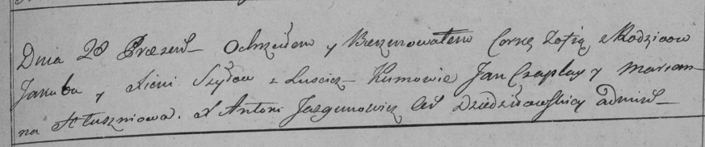

**Шило Зофья Якубова (Szyłowna Zofia)**

28 ноября 1798 г -- крещение дочери Зофьи (НИАБ 136-13-894, лист 37об,
№57/1798-р (ориг)), (РГИА 823-2-18, лист 267, №58/1798-р (коп)).

**НИАБ 136-13-894:** Лист 37об. **Метрическая запись №57/1798-р
(ориг).**

Дедиловичская Покровская церковь. 28 \[ноября\] 1798 года. Метрическая
запись о крещении.

Szyłowna Zofia -- дочь родителей с деревни Лустичи.

Szyło Jakub -- отец.

Szyłowa Xienia -- мать.

Czaplay Jan - кум.

Hłuszniowa Marjana - кума.

Jazgunowicz Antoni -- ксёндз.

**РГИА 823-2-18:** Лист 267. **Метрическая запись №58/1798-р (коп).**

Дедиловичская Покровская церковь. \[28\] ноября 1798 года. Метрическая
запись о крещении.

Szyłowna Zofia -- дочь родителей с деревни Лустичи.

Szyło Jakub -- отец.

Szyłowa Xienia -- мать.

Czaplay Jan -- кум.

Hłuszniowa Marianna -- кума.

Jazgunowicz Antoni -- ксёндз.
