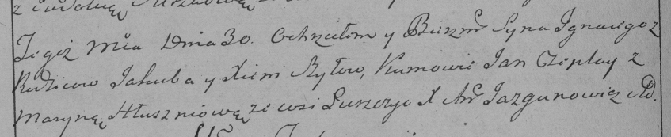

**Шило Игнацы Якубов (Szyło Jgnacy)**

30 января 1789 г -- крещение (НИАБ 136-13-894, лист 6, №4/1789-р
(ориг)), (РГИА 823-2-18, лист 237об, №3/1789-р (коп)).

**НИАБ 136-13-894:** Лист 6. **Метрическая запись №4/1789-р (ориг).**

Дедиловичская Покровская церковь. 30 января 1789 года. Метрическая
запись о крещении.

Szyło Jgnacy -- сын родителей с деревни Лустичи.

Szyło Jakub -- отец.

Szyłowa Xienia -- мать.

Czaplay Jan - кум.

Hłuszniowa Maryna - кума.

Jazgunowicz Antoni -- ксёндз.

**РГИА 823-2-18:** Лист 237об. **Метрическая запись №3/1789-р (коп).**

Дедиловичская Покровская церковь. 30 января 1789 года. Метрическая
запись о крещении.

Szyło Jgnacy -- сын родителей с деревни Лустичи.

Szyło Jakub -- отец.

Szyłowa Xienia -- мать.

Czaplay Jan -- кум.

Hłuszniowa Maryna - кума.

Jazgunowicz Antoni -- ксёндз.
