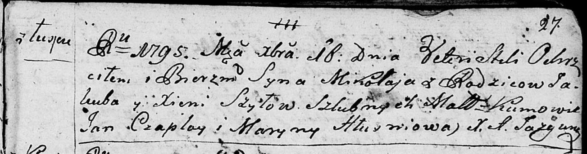
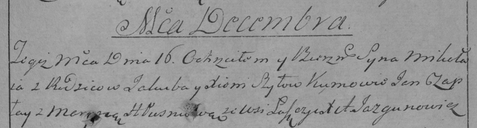

**Шило Миколай Якубов (Szyło Mikołay)**

16 декабря 1795 г -- крещение (НИАБ 136-13-894, лист 27, №61/1795-р
(ориг)), (РГИА 823-2-18, лист 254, №44/1795-р (коп)).

**НИАБ 136-13-894:** Лист 27. **Метрическая запись №61/1795-р (ориг).**

Дедиловичская Покровская церковь. 16 декабря 1795 года. Метрическая
запись о крещении.

Szyło Mikołay -- сын родителей с деревни Лустичи.

Szyło Jakub -- отец.

Szyło Xienia -- мать.

Czaplay Jan - кум.

Hłuszniowa Maryna - кума.

Jazgunowicz Antoni -- ксёндз.

**РГИА 823-2-18:** Лист 254. **Метрическая запись №44/1795-р (коп).**

Дедиловичская Покровская церковь. 16 декабря 1795 года. Метрическая
запись о крещении.

Szyło Mikołay -- сын родителей с деревни Лустичи.

Szyło Jakub -- отец.

Szyłowa Xienia -- мать.

Czaplay Jan -- кум.

Hłuszniowa Maryia -- кума.

Jazgunowicz Antoni -- ксёндз.
