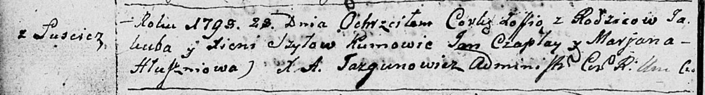

**Шило Паланея Якубова (Szyłowna Pałanieja)**

20 ноября 1791 г -- крещение (НИАБ 136-13-894, лист 14об, №61/1791-р
(ориг)).

**НИАБ 136-13-894:** Лист 14-об. **Метрическая запись №61/1791-р
(ориг).**

{width="6.496527777777778in"
height="0.9668689851268591in"}

Дедиловичская Покровская церковь. 20 ноября 1791 года. Метрическая
запись о крещении.

Szyłowna Pałanieja -- дочь родителей с деревни Лустичи.

Szyło Jakub -- отец.

Szyłowa Xienia -- мать.

Czaplay Jan - кум.

Kowalowa Maryna - кума.

Jazgunowicz Antoni -- ксёндз.
