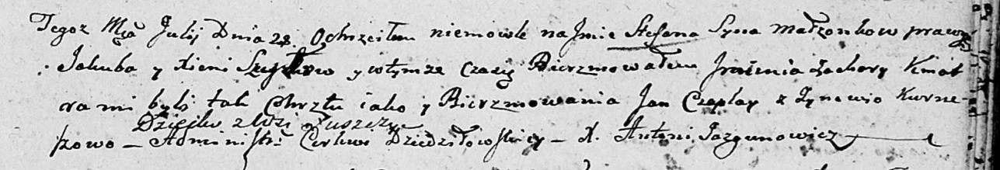

**Шило Степан Якубов (Szyło Stefan Zachary)**

28 июля 1801 г -- крещение (НИАБ 136-13-894, лист 44, №18/1801-р
(ориг)).

**НИАБ 136-13-894:** Лист 44. **Метрическая запись №18/1801-р (ориг).**

Дедиловичская Покровская церковь. 28 июля 1801 года. Метрическая запись
о крещении.

Szyło Stefan Zachary -- сын родителей с деревни Лустичи.

Szyło Jakub -- отец.

Szyłowa Xienia -- мать.

Czaplay Jan -- кум.

Kurneszowa Zynowija -- кума.

Jazgunowicz Antoni -- ксёндз.
