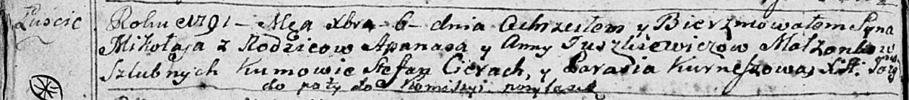

**Юшкевич Зося Апанасова (Juszkiewiczowna Zosia)**

7 апреля 1797 г -- крещение (НИАБ 136-13-894, лист 32об, №19/1797-р
(ориг)), (РГИА 823-2-18, лист 259об, №17/1797-р (коп)).

Лист 32об. **Метрическая запись №19/1797-р (ориг).**

{width="6.496527777777778in"
height="1.2424464129483814in"}

Дедиловичская Покровская церковь. 7 апреля 1797 года. Метрическая запись
о крещении.

Juszkiewiczowna Zosia -- дочь родителей с деревни Лустичи.

Juszkiewicz Apanas -- отец.

Juszkiewiczowa Anna -- мать.

Cierach Stefan - кум.

Kurneszycha Parasia - кума.

Jazgunowicz Antoni -- ксёндз.

**РГИА 823-2-18:** Лист 259об. **Метрическая запись №17/1797-р (коп).**

{width="6.496527777777778in"
height="1.8138888888888889in"}

Дедиловичская Покровская церковь. 7 апреля 1797 года. Метрическая запись
о крещении.

Juszkiewiczowna Zosia -- дочь родителей с деревни Лустичи.

Juszkiewicz Apanas -- отец.

Juszkiewiczowa Anna -- мать.

Cierach Stefan -- кум.

Kurniszowa Prosia -- кума.

Jazgunowicz Antoni -- ксёндз.
