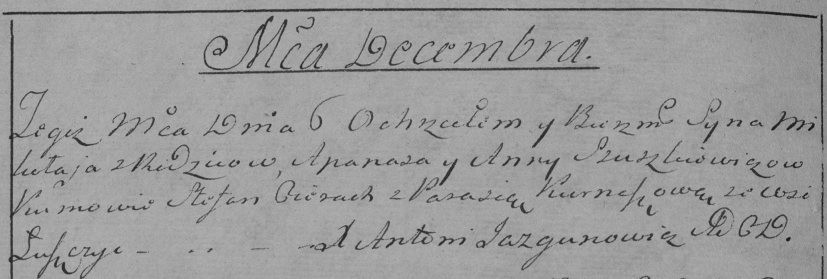

**Юшкевич Миколай Апанасов (Juszkiewicz Mikołay)**

6 декабря 1791 г -- крещение (НИАБ 136-13-894, лист 14об, №65/1791-р
(ориг)), РГИА 823-2-18, лист 243, №33об/1791-р (коп)).

**НИАБ 136-13-894:** Лист 14-об. **Метрическая запись №65/1791-р
(ориг).**

Дедиловичская Покровская церковь. 6 декабря 1791 года. Метрическая
запись о крещении.

Juszkiewicz Mikołay -- сын родителей с деревни Лустичи.

Juszkiewicz Apanas -- отец.

Juszkiewiczowa Anna -- мать.

Cierach Stefan - кум.

Kurneszowa Parasia - кума.

Jazgunowicz Antoni -- ксёндз.

**РГИА 823-2-18:** Лист 243об. **Метрическая запись №33/1791-р (коп).**

Дедиловичская Покровская церковь. 6 декабря 1791 года. Метрическая
запись о крещении.

\[J\]uszkiewicz Mikołay -- сын родителей с деревни Лустичи.

\[J\]uszkiewicz Apanas -- отец.

\[J\]uszkiewiczowa Anna -- мать.

Cierach Stefan -- кум.

Kurneszowa Parasia - кума.

Jazgunowicz Antoni -- ксёндз.
