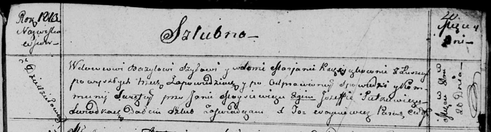

**Шило Марьяна (Szyłowa Marjana)**

20 октября 1813 г -- венчание с вдовцом Базылем Шыло с деревни
Дедиловичи (НИАБ 136-13-920, лист 20, №15/1813-б (ориг)).

**НИАБ 136-13-920:** Лист 20. **Метрическая запись №15/1813-б (ориг).**

{width="6.496527777777778in"
height="1.752030839895013in"}

Осовская Покровская церковь. 20 октября 1813 года. Запись о венчании.

Szyło Bazyl -- жених, вдовец, с деревни Дедиловичи.

K...czkowna? Marjana -- невеста, вдова, с деревни Лустичи.

Moysiewicz Jan -- свидетель.

Pietkiewicz Jozef -- свидетель.

Woyniewicz Tomasz -- ксёндз.
