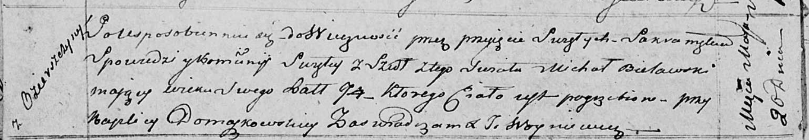

**Белявский Михал (Bielawski Michał)**

20 мая 1818 г -- отпевание, умер в возрасте 94 лет (родился около 1724
г) (НИАБ 136-13-919, лист 31об, №8/1818-у (ориг)).

**НИАБ 136-13-919:** Лист 31об. **Метрическая запись №8/1818-у (ориг).**

Осовская униатская церковь. 20 мая 1818 года. Метрическая запись об
отпевании.

Bielawski Michał -- умерший, 94 года, с деревни Озерщизна, похоронен при
каплице Домашковичской.

Woyniewicz Tomasz -- ксёндз.
