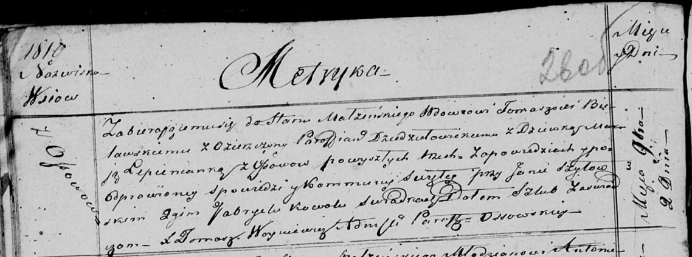

**Белявский Томаш (Bielawski Tomasz)**

2 ноября 1819 г -- венчание с девкой Марией Лепешко с деревни Осово
(НИАБ 136-13-920, лист 26об, №8/1819-б (ориг)).

**НИАБ 136-13-920:** Лист 26об. **Метрическая запись №8/1819-б (ориг).**

Осовская Покровская церковь. 2 ноября 1819 года. Запись о венчании.

Bielawski Tomasz -- жених, вдовец, парафии Дедиловичской католической, с
деревни Озерщина.

Lepienkanka Marija -- невеста, девка, с деревни Осово.

Szyłowski Jan -- свидетель.

Kowal Gabryel -- свидетель.

Woyniewicz Tomasz -- ксёндз.
