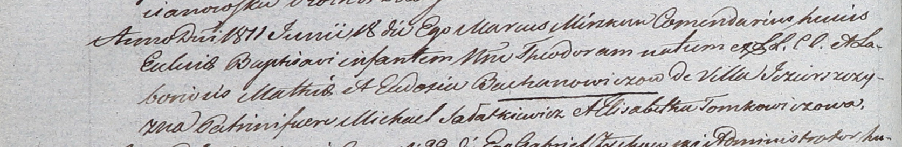

**Боханович Тодора Мацеева (Bachanowiczowna Theodora)**

18 июня 1811 г -- крещение (НИАБ 937-4-32, лист 23об, №13/1811-р).

**НИАБ 937-4-32:** Лист 23об. **Метрическая запись №13/1811-р.**

Дедиловичский костел Наисвятейшего Сердца Иисуса. 18 июня 1811 года.
Метрическая запись о крещении.

Bachanowiczowna Theodora -- дочь крестьян с деревни Озерщизна.

Bachanowicz Mathias -- отец.

Bachanowiczowa Eudoxia -- мать.

Sałatkiewicz Michael -- крестный отец.

Tomkowiczowa Elisabetha -- крестная мать.

Miszkun Marcus -- ксёндз, комендант.
