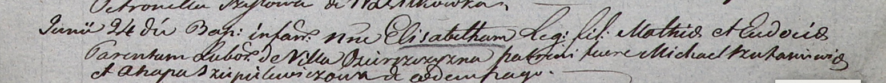

**Боханович Элизабета Мацеева (Bochanowiczowna Elisabetha)**

24 июня 1804 г -- крещение (НИАБ 937-4-32, лист 10, №15/1804-р).

**НИАБ 937-4-32:** Лист 10. **Метрическая запись №15/1804-р.**

Дедиловичский костел Наисвятейшего Сердца Иисуса. 24 июня 1804 года.
Метрическая запись о крещении.

Elisabetha -- дочь крестьян с деревни Озерщизна.

Mathias -- отец.

Eudocia -- мать.

Szukaniewicz? Michael -- крестный отец.

Sziepelewiczowa Ahapa -- крестная мать, с деревни Озерщизна.

Galinowski Joann -- ксёндз, комендант Дедиловичского костела.
