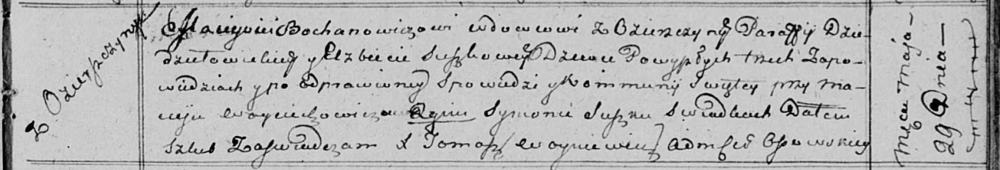

**Боханович Мацей (Bochanowicz Maciey)**

29 мая 1815 г -- венчание с девкой Елисаветой Сушко (НИАБ 136-13-920,
лист 22, №3/1815-б (ориг)).

**НИАБ 136-13-894:** Лист 22. **Метрическая запись №3/1815-б (ориг).**

Осовская Покровская церковь. 29 мая 1815 года. Запись о венчании.

Bochanowicz Maciey -- жених, вдовец, парафии Дедиловичской католической,
с деревни Озерщизна.

Suszkowa Elżbieta -- невеста, девка.

Woyciechowicz Maciey -- свидетель.

Suszko Symon -- свидетель.

Woyniewicz Tomasz -- ксёндз.
