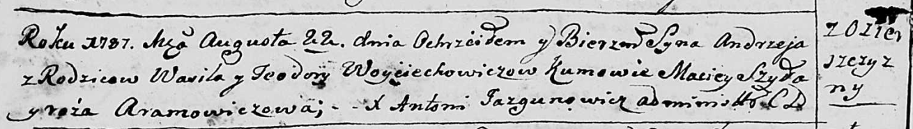
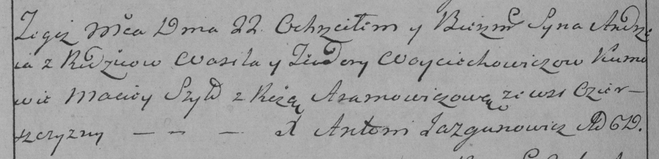

**Войцехович Андрей Василев (Woyciechowicz Andrzey)**

22 августа 1787 г -- крещение (НИАБ 136-13-894, лист 2об, №38/1787-р
(ориг)), (РГИА 823-2-18, лист 234об, №23/1787-р (коп)).

**НИАБ 136-13-894:** Лист 2об. **Метрическая запись №38/1787-р (ориг).**

Дедиловичская Покровская церковь. 22 августа 1787 года. Метрическая
запись о крещении.

Woyciechowicz Andrzej - сын родителей с деревни Озерщизна.

Woyciechowicz Wasil -- отец.

Woyciechowiczowa Teodora -- мать.

Szylo Maciey - кум.

Aramowiczowa Róza - кума.

Jazgunowicz Antoniusz -- ксёндз.

**РГИА 823-2-18:** Лист 234об. **Метрическая запись №23/1787-р (коп).**

Дедиловичская Покровская церковь. 22 августа 1787 года. Метрическая
запись о крещении.

Woyciechowicz Andrzey -- сын родителей с деревни Озерщизны.

Woyciechowicz Wasil -- отец.

Woyciechowiczowa Teodora -- мать.

Szyło Maciey -- кум.

Aramowiczowa Róza - кума.

Jazgunowicz Antoni -- ксёндз.
