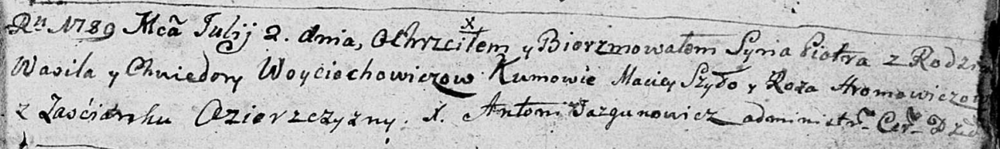

**Войцехович Василь (Woyciechowicz, Woyciochowicz Wasil)**

22 августа 1787 г -- крещение сына Андрея (НИАБ 136-13-894, лист 2об,
№38/1787-р (ориг)), (РГИА 823-2-18, лист 234об, №23/1787-р (коп)).

2 июля 1789 г -- крещение сына Петра (НИАБ 136-13-894, лист 7,
№34/1789-р (ориг)), (РГИА 823-2-18, лист 238, №15/1789-р (коп)).

15 мая 1793 г -- крещение сына Изыдора (НИАБ 136-13-894, лист 19об,
№41/1793-р (ориг)), (РГИА 823-2-18, лист 247об, №20/1793-р (коп)).

27 августа 1794 г -- крещение сына Мацея (НИАБ 136-13-894, лист 22об,
№34/1794-р (ориг)), (РГИА 823-2-18, лист 250об, №24/1794-р (коп)).

19 апреля 1797 г -- крещение дочери Марьяны (НИАБ 136-13-894, лист 32об,
№22/1797-р (ориг)).

**НИАБ 136-13-894:** Лист 2об. **Метрическая запись №38/1787-р (ориг).**

{width="6.496527777777778in"
height="0.9273086176727909in"}

Дедиловичская Покровская церковь. 22 августа 1787 года. Метрическая
запись о крещении.

Woyciechowicz Andrzej - сын родителей с деревни Озерщизна.

Woyciechowicz Wasil -- отец.

Woyciechowiczowa Teodora -- мать.

Szylo Maciey - кум.

Aramowiczowa Róza - кума.

Jazgunowicz Antoniusz -- ксёндз.

**РГИА 823-2-18:** Лист 234об. **Метрическая запись №23/1787-р (коп).**

{width="6.496527777777778in"
height="1.5715277777777779in"}

Дедиловичская Покровская церковь. 22 августа 1787 года. Метрическая
запись о крещении.

Woyciechowicz Andrzey -- сын родителей с деревни Озерщизны.

Woyciechowicz Wasil -- отец.

Woyciechowiczowa Teodora -- мать.

Szyło Maciey -- кум.

Aramowiczowa Róza - кума.

Jazgunowicz Antoni -- ксёндз.

**НИАБ 136-13-894:** Лист 7. **Метрическая запись №34/1789-р (ориг).**

{width="6.496527777777778in"
height="0.9695505249343832in"}

Дедиловичская Покровская церковь. 2 июля 1789 года. Метрическая запись о
крещении.

Woyciochowicz Piotr -- сын родителей с застенка Озерщизна.

Woyciochowicz Wasil -- отец.

Woyciochowiczowa Chwiedora -- мать.

Szyło Maciey - кум.

Hromowiczowa Roza - кума.

Jazgunowicz Antoni -- ксёндз.

**РГИА 823-2-18:** Лист 238. **Метрическая запись №15/1789-р (коп).**

{width="6.496527777777778in"
height="1.4194444444444445in"}

Дедиловичская Покровская церковь. 2 июля 1789 года. Метрическая запись о
крещении.

Woyciechowicz Paweł \[Piotr\] -- сын родителей с застенка Озерщизна.

Woyciechowicz Wasil -- отец.

Woyciechowiczowa Chwiedora -- мать.

Szyło Maciey -- кум.

Hromowiczowa Róza - кума.

Jazgunowicz Antoni -- ксёндз.

**НИАБ 136-13-894:** Лист 19-об. **Метрическая запись №41/1793-р
(ориг).**

{width="6.496527777777778in"
height="0.45527340332458444in"}

Дедиловичская Покровская церковь. 15 мая 1793 года. Метрическая запись о
крещении.

Woyciechowicz Jzydor -- сын родителей с деревни Озерщизна.

Woyciechowicz Wasil -- отец.

Woyciechowiczowa Chwiedora -- мать.

Szyło Leon - кум.

Szyłowa Ahapa - кума.

Jazgunowicz Antoni -- ксёндз.

**РГИА 823-2-18:** Лист 247об. **Метрическая запись №20/1793-р (коп).**

{width="6.496527777777778in"
height="1.7083333333333333in"}

Дедиловичская Покровская церковь. 15 мая 1793 года. Метрическая запись о
крещении.

Woyciechowicz Jzydor -- сын родителей с деревни Озерщизна.

Woyciechowicz Wasil -- отец.

Woyciechowiczowa Chwiedora -- мать.

Szyło Leon -- кум.

Szyłowa Ahafia -- кума.

Jazgunowicz Antoni -- ксёндз.

**НИАБ 136-13-894:** Лист 22об. **Метрическая запись №34/1794-р
(ориг).**

{width="6.496527777777778in"
height="0.8502012248468941in"}

Дедиловичская Покровская церковь. 27 августа 1794 года. Метрическая
запись о крещении.

Woyciechowicz Maciey -- сын родителей с деревни Озерщизна.

Woyciechowicz Wasil -- отец.

Woyciechowiczowa Chwiedora -- мать.

Szyło Leon - кум.

Hromowiczowa Roza - кума.

Jazgunowicz Antoni -- ксёндз.

**РГИА 823-2-18:** Лист 250об. **Метрическая запись №24/1794-р (коп).**

{width="6.496527777777778in"
height="1.3604166666666666in"}

Дедиловичская Покровская церковь. 27 августа 1794 года. Метрическая
запись о крещении.

Woyciechowicz Maciey -- сын родителей с деревни Озерщизна.

Woyciechowicz Wasil -- отец.

Woyciechowiczowa Chwiedora -- мать.

Szyła Leon -- кум.

Aramowicz Róza -- кума.

Jazgunowicz Antoni -- ксёндз.

**НИАБ 136-13-894:** Лист 32об. **Метрическая запись №22/1797-р
(ориг).**

{width="6.496527777777778in"
height="1.3778893263342082in"}

Дедиловичская Покровская церковь. 19 апреля 1797 года. Метрическая
запись о крещении.

Woyciechowiczowna Marjana -- дочь родителей с деревни Озерщизна.

Woyciechowicz Wasil -- отец.

Woyciechowiczowa Chwiedora -- мать.

Szyło Leon - кум.

Hromowiczowa Roza - кума.

Jazgunowicz Antoni -- ксёндз.
