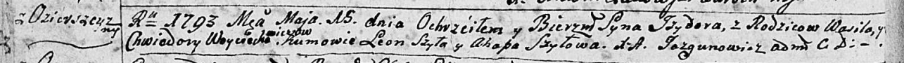

**Войцехович Изыдор Василев (Woyciechowicz Jzydor)**

15 мая 1793 г -- крещение (НИАБ 136-13-894, лист 19об, №41/1793-р
(ориг)), (РГИА 823-2-18, лист 247об, №20/1793-р (коп)).

**НИАБ 136-13-894:** Лист 19-об. **Метрическая запись №41/1793-р
(ориг).**

Дедиловичская Покровская церковь. 15 мая 1793 года. Метрическая запись о
крещении.

Woyciechowicz Jzydor -- сын родителей с деревни Озерщизна.

Woyciechowicz Wasil -- отец.

Woyciechowiczowa Chwiedora -- мать.

Szyło Leon - кум.

Szyłowa Ahapa - кума.

Jazgunowicz Antoni -- ксёндз.

**РГИА 823-2-18:** Лист 247об. **Метрическая запись №20/1793-р (коп).**

Дедиловичская Покровская церковь. 15 мая 1793 года. Метрическая запись о
крещении.

Woyciechowicz Jzydor -- сын родителей с деревни Озерщизна.

Woyciechowicz Wasil -- отец.

Woyciechowiczowa Chwiedora -- мать.

Szyło Leon -- кум.

Szyłowa Ahafia -- кума.

Jazgunowicz Antoni -- ксёндз.
