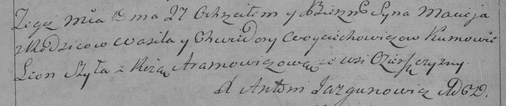

**Войцехович Мацей Василев (Woyciechowicz Maciey)**

27 августа 1794 г -- крещение (НИАБ 136-13-894, лист 22об, №34/1794-р
(ориг)), (РГИА 823-2-18, лист 250об, №24/1794-р (коп)).

**НИАБ 136-13-894:** Лист 22об. **Метрическая запись №34/1794-р
(ориг).**

{width="6.496527777777778in"
height="0.8502012248468941in"}

Дедиловичская Покровская церковь. 27 августа 1794 года. Метрическая
запись о крещении.

Woyciechowicz Maciey -- сын родителей с деревни Озерщизна.

Woyciechowicz Wasil -- отец.

Woyciechowiczowa Chwiedora -- мать.

Szyło Leon - кум.

Hromowiczowa Roza - кума.

Jazgunowicz Antoni -- ксёндз.

**РГИА 823-2-18:** Лист 250об. **Метрическая запись №24/1794-р (коп).**

{width="6.496527777777778in"
height="1.3604166666666666in"}

Дедиловичская Покровская церковь. 27 августа 1794 года. Метрическая
запись о крещении.

Woyciechowicz Maciey -- сын родителей с деревни Озерщизна.

Woyciechowicz Wasil -- отец.

Woyciechowiczowa Chwiedora -- мать.

Szyła Leon -- кум.

Aramowicz Róza -- кума.

Jazgunowicz Antoni -- ксёндз.
