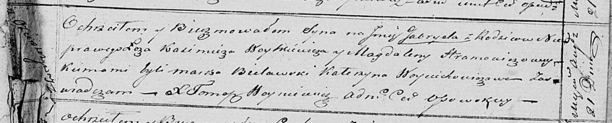

**Гапанович Магдалена (Hapanowicz Magdalena)**

21 августа 181 г -- крещение незаконнорожденного сына Габриэля (НИАБ
136-13-894, лист 107, №40/1821-р (ориг)).

**НИАБ 136-13-894:** Лист 107. **Метрическая запись №40/1821-р (ориг).**

Осовская Покровская церковь. 21 августа 1821 года. Метрическая запись о
крещении.

Gabriel -- незаконнорожденный сын с деревни Озерщизна.

Woytkiewicz Kazimierz -- отец.

Hapanowiczowa Magdalena -- мать, деревня Озерщизна.

Bielawski Marko -- кум.

Woyciechowiczowa Katerzyna -- кума.

Woyniewicz Tomasz -- ксёндз.
