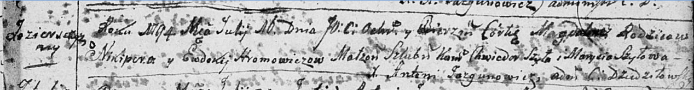

**Громович Магдалена Никиперова (Hromowiczowna Magdalena)**

16 июля 1794 г -- крещение (НИАБ 136-13-894, лист 22, №28/1794-р
(ориг)).

**НИАБ 136-13-894:** Лист 22. **Метрическая запись №28/1794-р (ориг).**

Дедиловичская Покровская церковь. 16 июля 1794 года. Метрическая запись
о крещении.

Hromowiczowna Magdalena -- дочь родителей с деревни Озерщизна.

Hromowicz Nikiper -- отец.

Hromowiczowa Ewdokija -- мать.

Szyło Chwiedor - кум.

Szyłowa Marysia - кума.

Jazgunowicz Antoni -- ксёндз.
