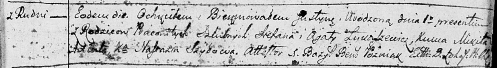
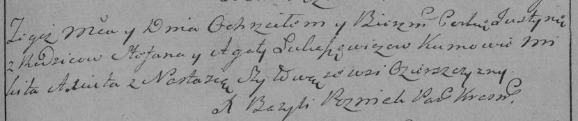

**Лукашевич Хрыстына Степанова (Łukaszewiczowna Krystyna)**

2 октября 1791 г -- крещение (НИАБ 136-13-894, лист 14, №48/1791-р
(ориг)), (РГИА 823-2-18, лист 242, №24/1791-р (коп)) .

**НИАБ 136-13-894:** Лист 14. **Метрическая запись №48/1791-р (ориг).**

Дедиловичская Покровская церковь. 2 октября 1791 года. Метрическая
запись о крещении.

Łukaszewiczowna Justyna -- дочь родителей с деревни Озерщизна, родилась
1 октября 1791 года.

Łukaszewicz Stefan -- отец, селянин.

Łukaszewiczowa Agata -- мать, селянка.

Axiuta Mikita - кум.

Szyłowa Nastazia - кума.

Pozniak Bazyl Benedykt -- ксёндз Логойской церкви.

**РГИА 823-2-18:** Лист 243. **Метрическая запись №26/1791-р (коп).**

Дедиловичская Покровская церковь. 2 октября 1791 года. Метрическая
запись о крещении.

Łukaszewiczowna Justyna -- дочь родителей с деревни Озерщизна.

Łukaszewicz Stefan -- отец.

Łukaszewiczowa Agata -- мать.

Axiuta Mikita -- кум.

Szyłowa Nastazia - кума.

Pozniak Bazyli -- ксёндз.
