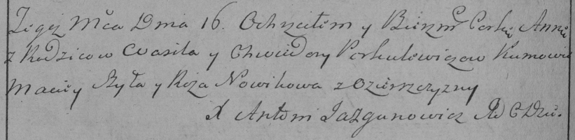

**Поркулевич Василь (Porkulewicz Wasil)**

16 августа 1785 г -- крещение дочери Анны (РГИА 823-2-18, лист 229об,
№19/1785-р (коп)).

**РГИА 823-2-18:** Лист 229об. **Метрическая запись №19/1785-р (коп).**

{width="6.496527777777778in"
height="1.582638888888889in"}

Дедиловичская Покровская церковь. 16 августа 1785 года. Метрическая
запись о крещении.

Porkulewiczowna Anna -- дочь родителей с деревни Озерщизны.

Porkulewicz Wasil -- отец.

Porkulewiczowa Chwiedora -- мать.

Szyło Maciey -- кум.

Nowikowa Roza - кума.

Jazgunowicz Antoni -- ксёндз.
