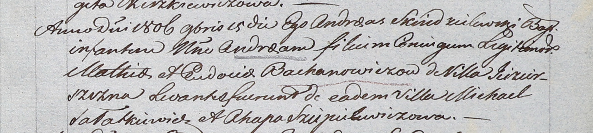
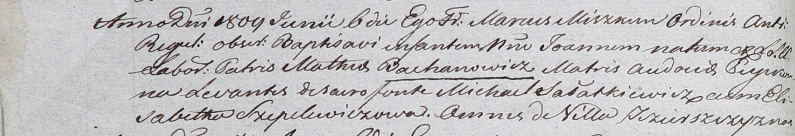

**Саладкевич Михал (Sałatkiewicz Michael)**

15 ноября 1806 г -- крестный отец Андрея, сына Мацея и Евдокии
Бахановичей с деревни Озерщизна (НИАБ 937-4-32, лист 14, №23/1806-р).

6 июня 1809 г -- крестный отец Иоанна, сына Мацея и Евдокии Бахановичей
с деревни Озерщизна (НИАБ 937-4-32, лист 19об, №14/1809-р).

**НИАБ 937-4-32:** Лист 14. **Метрическая запись №23/1806-р.**

Дедиловичский костел Наисвятейшего Сердца Иисуса. 15 ноября 1806 года.
Метрическая запись о крещении.

Bachanowicz Andreas -- сын родителей с деревни Озерщизна.

Bachanowicz Mathias -- отец.

Bachanowiczowa Eudocia -- мать.

Sałatkiewicz Michael -- крестный отец, с деревни Озерщизна.

Sziepielewiczowa Ahapa -- крестная мать, с деревни Озерщизна.

Skindzelewski Andreas -- ксёндз, комендант Дедиловичский.

**НИАБ 937-4-32:** Лист 19об. **Метрическая запись №14/1809-р.**

Дедиловичский костел Наисвятейшего Сердца Иисуса. 6 июня 1809 года.
Метрическая запись о крещении.

Bachanowicz Joann -- сын крестьян с деревни Озерщизна.

Bachanowicz Mathei -- отец.

Bachanowiczowa Audocia -- мать.

Sałatkiewicz Michael -- крестный отец, с деревни Озерщизна.

Szepelewiczowa Elisabetha -- крестная мать, с деревни Озерщизна.

Miszkun Marcus -- ксёндз.
