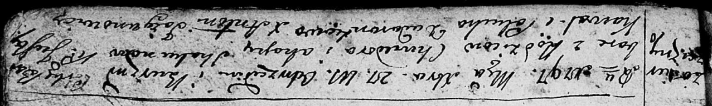

**Скакун Варвара Хведорова (Skakunowna Barbara)**

27 декабря 1797 г -- крещение (НИАБ 136-13-894, лист 34, №55/1797-р
(ориг)).

**НИАБ 136-13-894:** Лист 34. **Метрическая запись №55/1797-р (ориг).**

Дедиловичская Покровская церковь. 27 декабря 1797 года. Метрическая
запись о крещении.

Skakunowna Barbara -- дочь родителей с деревни Озерщизна.

Skakun Chwiedor -- отец.

Skakunowa Ahapa -- мать.

Kawal Justyn - кум.

Dudaronkowa Palucha - кума.

Jazgunowicz Antoni -- ксёндз.
