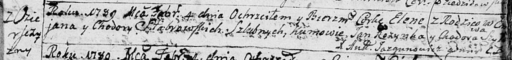
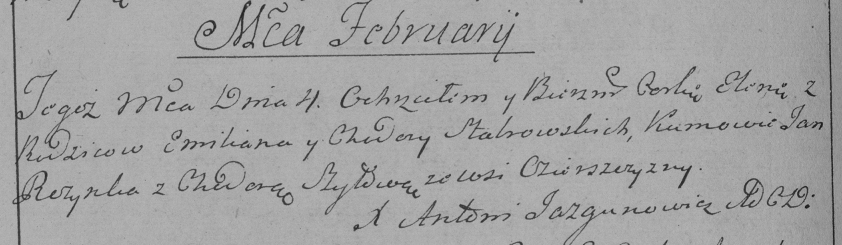

**Стабровская Елена Емильянова (Stabrowska Elena)**

4 февраля 1789 г -- крещение (НИАБ 136-13-894, лист 6, №5/1789-р
(ориг)), (РГИА 823-2-18, лист 237об, №4/1789-р (коп)).

**НИАБ 136-13-894:** Лист 6. **Метрическая запись №5/1789-р (ориг).**

Дедиловичская Покровская церковь. 4 февраля 1789 года. Метрическая
запись о крещении.

Stabrowska Elena -- дочь родителей с деревни Озерщизна.

Stabrowski \[Emiljan\] -- отец.

Stabrowska Chodora -- мать.

Rozynka Jan - кум.

Szyłowa Chodora - кума.

Jazgunowicz Antoni -- ксёндз.

**РГИА 823-2-18:** Лист 237об. **Метрическая запись №4/1789-р (коп).**

Дедиловичская Покровская церковь. 4 февраля 1789 года. Метрическая
запись о крещении.

Stabrowska Elena -- дочь родителей с деревни Озерщизна.

Stabrowski Emilian -- отец.

Stabrowska Chodora -- мать.

Rozynko Jan -- кум.

Szyłowa Chodora - кума.

Jazgunowicz Antoni -- ксёндз.
