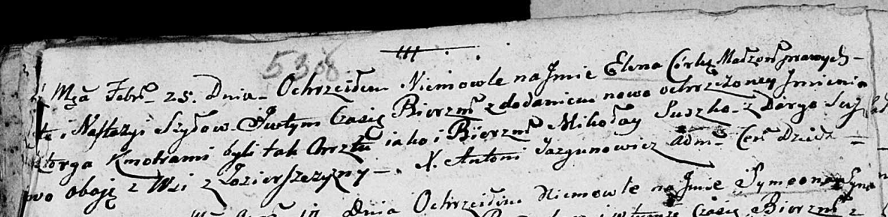

**Сушко Миколай (Suszko Mikołay)**

25 февраля 1804 г -- крестный отец у Елены Викторыи?, дочери дочери Шил
? и Настасьи (НИАБ 136-13-894, лист 53об, №10/1804-р (ориг)).

**НИАБ 136-13-894:** Лист 53об. **Метрическая запись №10/1804-р
(ориг).**

{width="6.496527777777778in"
height="1.594461942257218in"}

Дедиловичская Покровская церковь. 25 февраля 1804 года. Метрическая
запись о крещении.

Szyłowna Elena Wiktorya? -- дочь.

Szyło ? -- отец.

Szyłowa Nastazyja -- мать.

Suszko Mikołay -- кум, с деревни Озерщизна.

Suszkowa Daryja -- кума, с деревни Озерщизна.

Jazgunowicz Antoni -- ксёндз.
