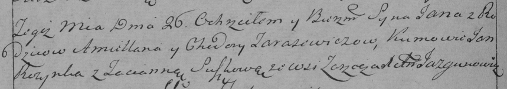

**Тарасевич Емельян (Tarasewicz Emiljan)**

8 ноября 1787 г -- венчание с вдовой Ходорой Кудич (НИАБ 136-13-894,
лист 66, №10/1787-б (ориг)).

26 января 1791 г -- крещение сына Яна (НИАБ 136-13-894, лист 12,
№3/1791-р (ориг)), (НИАБ 136-13-894, лист 12, №3/1791-р (ориг)).

15 мая 1793 г -- крещение сыновей близнецов Сымона и Миколая (НИАБ
136-13-894, лист 19об, №43/1793-р (ориг)), (РГИА 823-2-18, лист 247об,
№21/1793-р (коп)).

**НИАБ 136-13-894:** Лист 66. **Метрическая запись №10/1787-б (ориг).**

{width="6.496527777777778in"
height="1.0640923009623797in"}

Дедиловичская Покровская церковь. 8 ноября 1787 года. Метрическая запись
о венчании.

Tarasewicz Emiljan -- жених с деревни \[Озерщизна\].

Kudziczowa Chodora -- невеста, вдова.

Słabkowski Michaś -- свидетель.

Słabkowski Marko -- свидетель.

Jazgunowicz Antoni -- ксёндз.

**НИАБ 136-13-894:** Лист 12. **Метрическая запись №3/1791-р (ориг).**

{width="6.496527777777778in"
height="0.9628455818022748in"}

Дедиловичская Покровская церковь. 26 января 1791 года. Метрическая
запись о крещении.

Tarasewicz Jan -- сын родителей с деревни Озерщизна.

Tarasewicz Emiljan -- отец.

Tarasewiczowa Chodora -- мать.

Rozynko Jan - кум.

Suszko Taciana - кума.

Jazgunowicz Antoni -- ксёндз.

**РГИА 823-2-18:** Лист 241об. **Метрическая запись №3/1791-р (коп).**

{width="6.496527777777778in"
height="1.1493055555555556in"}

Дедиловичская Покровская церковь. 26 января 1791 года. Метрическая
запись о крещении.

Tarasewicz Jan -- сын родителей с деревни \[Озерщизна\].

Tarasewicz Amillan -- отец.

Tarasewiczowa Chodora -- мать.

Rozynko Jan -- кум.

Suszkowa Tacianna - кума.

Jazgunowicz Antoni -- ксёндз.

**НИАБ 136-13-894:** Лист 19-об. **Метрическая запись №43/1793-р
(ориг).**

{width="6.496527777777778in"
height="0.7268274278215223in"}

Дедиловичская Покровская церковь. 15 мая 1793 года. Метрическая запись о
крещении.

Tarasewicz Symon, Tarasewicz Mikołay -- сыновья близнецы родителей с
деревни Озерщизна.

Tarasewicz Emiljan -- отец.

Tarasewiczowa Chodora -- мать.

Skakun Anton -- кум Семена.

Rozynka Jan -- кум Николая.

Szyłakowa Chwiedora -- кума Семена.

Suszkowa Taćiana -- кума Николая.

Jazgunowicz Antoni -- ксёндз.

Лист 247об. **Метрическая запись №21/1793-р (коп).**

{width="6.496527777777778in"
height="1.9305555555555556in"}

Дедиловичская Покровская церковь. 15 мая 1793 года. Метрическая запись о
крещении.

Tarasewicz Symon -- сын родителей с деревни Озерщизна.

Tarasewicz Mikołay -- сын родителей с деревни Озерщизна.

Tarasewicz Emilian -- отец.

Tarasewiczowa Chodora -- мать.

Skakun Antoni -- кум.

Szyłowa Chodora -- кума.

Rozynka Jan -- кум.

Suszkowa Tacianna -- кума.

Jazgunowicz Antoni -- ксёндз.
