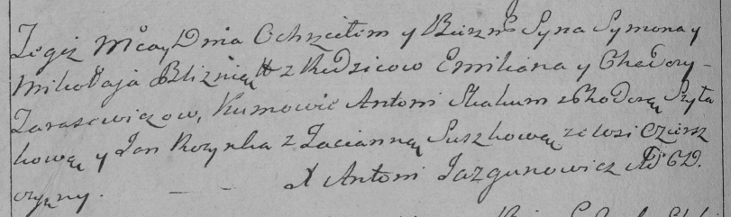

**Тарасевич Миколай Емельянов (Tarasewicz Mikołay)**

15 мая 1793 г -- крещение сыновей близнецов Сымона и Миколая (НИАБ
136-13-894, лист 19об, №43/1793-р (ориг)), (РГИА 823-2-18, лист 247об,
№21/1793-р (коп)).

**НИАБ 136-13-894:** Лист 19-об. **Метрическая запись №43/1793-р
(ориг).**

Дедиловичская Покровская церковь. 15 мая 1793 года. Метрическая запись о
крещении.

Tarasewicz Symon, Tarasewicz Mikołay -- сыновья близнецы родителей с
деревни Озерщизна.

Tarasewicz Emiljan -- отец.

Tarasewiczowa Chodora -- мать.

Skakun Anton -- кум Семена.

Rozynka Jan -- кум Николая.

Szyłakowa Chwiedora -- кума Семена.

Suszkowa Taćiana -- кума Николая.

Jazgunowicz Antoni -- ксёндз.

Лист 247об. **Метрическая запись №21/1793-р (коп).**

Дедиловичская Покровская церковь. 15 мая 1793 года. Метрическая запись о
крещении.

Tarasewicz Symon -- сын родителей с деревни Озерщизна.

Tarasewicz Mikołay -- сын родителей с деревни Озерщизна.

Tarasewicz Emilian -- отец.

Tarasewiczowa Chodora -- мать.

Skakun Antoni -- кум.

Szyłowa Chodora -- кума.

Rozynka Jan -- кум.

Suszkowa Tacianna -- кума.

Jazgunowicz Antoni -- ксёндз.
