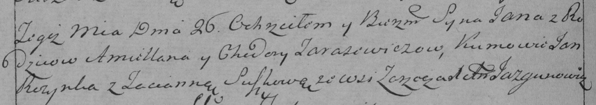

**Тарасевич Ян Емельянов (Tarasewicz Jan)**

26 января 1791 г -- крещение (НИАБ 136-13-894, лист 12, №3/1791-р
(ориг)), (НИАБ 136-13-894, лист 12, №3/1791-р (ориг)).

**НИАБ 136-13-894:** Лист 12. **Метрическая запись №3/1791-р (ориг).**

Дедиловичская Покровская церковь. 26 января 1791 года. Метрическая
запись о крещении.

Tarasewicz Jan -- сын родителей с деревни Озерщизна.

Tarasewicz Emiljan -- отец.

Tarasewiczowa Chodora -- мать.

Rozynko Jan - кум.

Suszko Taciana - кума.

Jazgunowicz Antoni -- ксёндз.

**РГИА 823-2-18:** Лист 241об. **Метрическая запись №3/1791-р (коп).**

Дедиловичская Покровская церковь. 26 января 1791 года. Метрическая
запись о крещении.

Tarasewicz Jan -- сын родителей с деревни \[Озерщизна\].

Tarasewicz Amillan -- отец.

Tarasewiczowa Chodora -- мать.

Rozynko Jan -- кум.

Suszkowa Tacianna - кума.

Jazgunowicz Antoni -- ксёндз.
