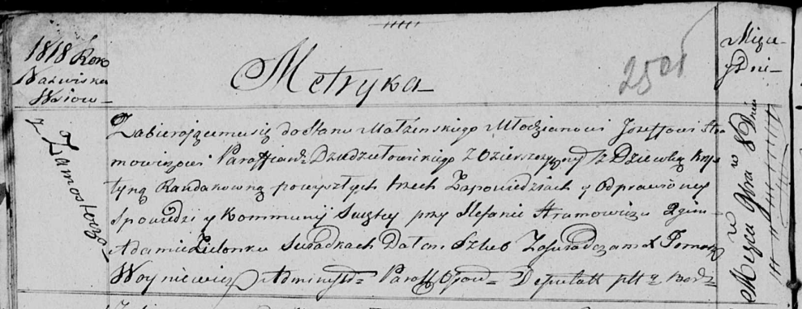

**Хромович Иосиф (Hramowicz Jozef)**

8 ноября 1818 г -- венчание с девкой Крыстыной Рандак с деревни
Замосточье (НИАБ 136-13-920, лист 25об, №7/1818-б (ориг)).

**НИАБ 136-13-920:** Лист 25об. **Метрическая запись №7/1818-б (ориг).**

Осовская Покровская церковь. 8 ноября 1818 года. Запись о венчании.

Hramowicz Jozef -- жених, молодой, парафии Дедиловичской католической, с
деревни Озерщизна.

Randakowna Krystyna -- невеста, девка, с деревни Замосточье.

Hramowicz Stefan -- свидетель.

Zielonka Adam -- свидетель.

Woyniewicz Tomasz -- ксёндз.
