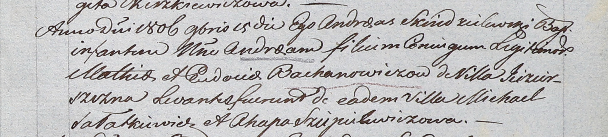

**Шапелевич Агапа (Sziepelewiczowa Ahapa)**

24 июня 1804 г -- крестная мать Элизабеты, дочери Бохановичей Мацея и
Евдокии с деревни Озерщизна (НИАБ 937-4-32, лист 10, №15/1804-р).

15 ноября 1806 г -- крестная мать Андрея, сына Мацея и Евдокии
Бахановичей с деревни Озерщизна (НИАБ 937-4-32, лист 14, №23/1806-р).

**НИАБ 937-4-32:** Лист 10. **Метрическая запись №15/1804-р.**

{width="6.496527777777778in"
height="0.6111111111111112in"}

Дедиловичский костел Наисвятейшего Сердца Иисуса. 24 июня 1804 года.
Метрическая запись о крещении.

Elisabetha -- дочь крестьян с деревни Озерщизна.

Mathias -- отец.

Eudocia -- мать.

Szukaniewicz? Michael -- крестный отец.

Sziepelewiczowa Ahapa -- крестная мать, с деревни Озерщизна.

Galinowski Joann -- ксёндз, комендант Дедиловичского костела.

**НИАБ 937-4-32:** Лист 14. **Метрическая запись №23/1806-р.**

{width="6.496527777777778in"
height="1.4618055555555556in"}

Дедиловичский костел Наисвятейшего Сердца Иисуса. 15 ноября 1806 года.
Метрическая запись о крещении.

Bachanowicz Andreas -- сын родителей с деревни Озерщизна.

Bachanowicz Mathias -- отец.

Bachanowiczowa Eudocia -- мать.

Sałatkiewicz Michael -- крестный отец, с деревни Озерщизна.

Sziepielewiczowa Ahapa -- крестная мать, с деревни Озерщизна.

Skindzelewski Andreas -- ксёндз, комендант Дедиловичский.
