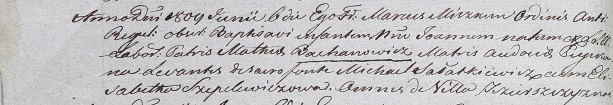

**Шапелевич Агапа (Sziepelewiczowa Ahapa)**

6 июня 1809 г -- крестная мать Иоанна, сына Мацея и Евдокии Бахановичей
с деревни Озерщизна (НИАБ 937-4-32, лист 19об, №14/1809-р).

**НИАБ 937-4-32:** Лист 19об. **Метрическая запись №14/1809-р.**

{width="6.496527777777778in"
height="1.1180555555555556in"}

Дедиловичский костел Наисвятейшего Сердца Иисуса. 6 июня 1809 года.
Метрическая запись о крещении.

Bachanowicz Joann -- сын крестьян с деревни Озерщизна.

Bachanowicz Mathei -- отец.

Bachanowiczowa Audocia -- мать.

Sałatkiewicz Michael -- крестный отец, с деревни Озерщизна.

Szepelewiczowa Elisabetha -- крестная мать, с деревни Озерщизна.

Miszkun Marcus -- ксёндз.
