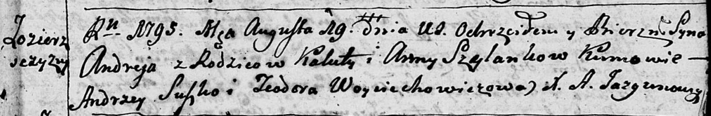
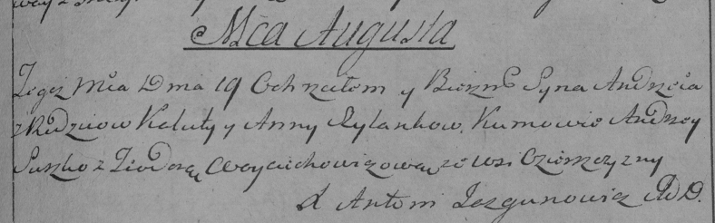

**Шиланка Анна (Szyłankowa Anna)**

19 августа 1795 г -- крещение сына Андрея (НИАБ 136-13-894, лист 25,
№29/1795-р (ориг)), (РГИА 823-2-18, лист 253, №22/1795-р (коп)).

**НИАБ 136-13-894:** Лист 25. **Метрическая запись №29/1795-р (ориг).**

Дедиловичская Покровская церковь. 19 августа 1795 года. Метрическая
запись о крещении.

Szyłanko Andrzey -- сын родителей с деревни Озерщизна.

Szyłanko Kaluta -- отец.

Szyłankowa Anna -- мать.

Suszko Andrzey - кум.

Woyciechowiczowa Teodora - кума.

Jazgunowicz Antoni -- ксёндз.

**РГИА 823-2-18:** Лист 253. **Метрическая запись №22/1795-р (коп).**

Дедиловичская Покровская церковь. 19 августа 1795 года. Метрическая
запись о крещении.

Szyłanko Andrzey -- сын родителей с деревни Озерщизна.

Szyłanko Kaluta -- отец.

Szyłanko Anna -- мать.

Suszko Andrzey -- кум.

Woyciechowiczowa Teodora -- кума.

Jazgunowicz Antoni -- ксёндз.
