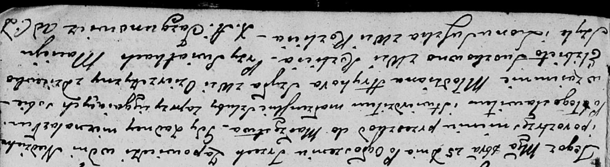

**Шило Грыгор (Szyło Hryhor)**

25 октября 1803 г -- венчание с девкой Елисаветой Сушко с деревни
Разлитье (НИАБ 136-13-920, лист 9, №5/1803-б (ориг)).

**НИАБ 136-13-920:** Лист 9. **Метрическая запись №5/1803-б (ориг).**

{width="6.496527777777778in"
height="1.7822036307961504in"}

Дедиловичская Покровская церковь. 25 октября 1803 года. Метрическая
запись о венчании.

Szyło Hryhor -- жених, молодой, с деревни Озерщизна.

Suszkowna Elżbieta -- невеста, девка, с деревни Разлитье.

Szyło Maciey -- свидетель.

Suszko Leon -- свидетель, с деревни Разлитье.

Jazgunowicz Antoni -- ксёндз.
