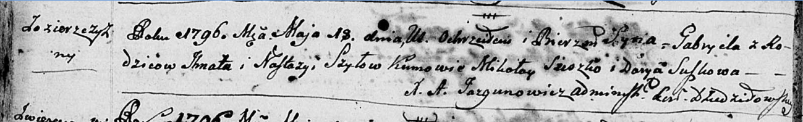
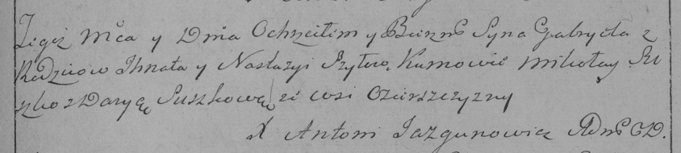

**Шило Габриэль Игнатов (Szyło Gabriel)**

18 мая 1796 г -- крещение (НИАБ 136-13-894, лист 29об, №54/1796-р
(ориг)), (РГИА 823-2-18, лист 256, №26/1796-р (коп)).

**НИАБ 136-13-894:** Лист 29-об. **Метрическая запись №54/1796-р
(ориг).**

Дедиловичская Покровская церковь. 18 мая 1796 года. Метрическая запись о
крещении.

Szyło Gabriel -- сын родителей с деревни Озерщизна.

Szyło Ihnat -- отец.

Szyłowa Nastazyia -- мать.

Szuszko Mikołay - кум.

Suszkowa Darya - кума.

Jazgunowicz Antoni -- ксёндз.

**РГИА 823-2-18:** Лист 256. **Метрическая запись №26/1796-р (коп).**

Дедиловичская Покровская церковь. 18 мая 1796 года. Метрическая запись о
крещении.

Szyło Gabriel -- сын родителей с деревни Озерщизна.

Szyło Jhnat -- отец.

Szyłowa Nastazya -- мать.

Suszko Mikołay -- кум.

Suszkowa Darya -- кума.

Jazgunowicz Antoni -- ксёндз.
