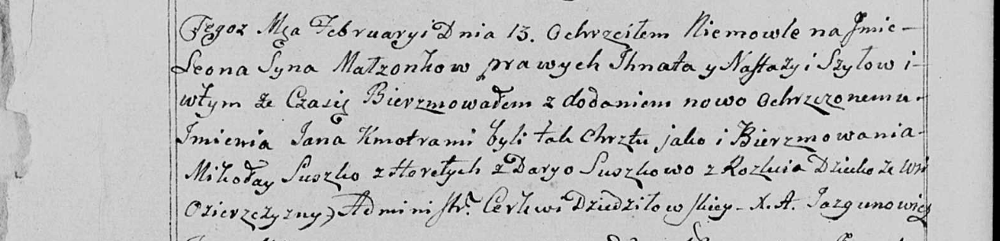

**Шило (Сушкова) Настасья (Szyłowa Nastazyia z Suszkow)**

24 января 1787 г -- венчание с Игнатом Шило (НИАБ 136-13-894, лист 66,
№3/1787-б (ориг)).

22 ноября 1788 г -- крещение сына Петра (НИАБ 136-13-894, лист 6,
№65/1788-р (ориг)), (РГИА 823-2-18, лист 237, №35/1788-р (коп)).

2 марта 1791 г -- крещение дочери Евдокии (НИАБ 136-13-894, лист 12об,
№6/1791-р (ориг)), (РГИА 823-2-18, лист 241об, №6/1791-р (коп)).

18 мая 1796 г -- крещение сына Габриэля (НИАБ 136-13-894, лист 29об,
№54/1796-р (ориг)), (РГИА 823-2-18, лист 256, №26/1796-р (коп)).

13 февраля 1799 г -- крещение сына Леона Яна (НИАБ 136-13-894, лист 38,
№8/1799-р (ориг)), (РГИА 823-2-18, лист 268, №7/1799-р (коп), НИАБ
136-13-938, лист 240об, №8/1799-р (коп)).

16 марта 1802 г -- крестная мать Марты Анны, дочери Сушков Андрея и Евы
с деревни Заречье (НИАБ 136-13-894, лист 46, №10/1802-р (ориг)).

8 января 1805 г -- крестная мать Стефана Базыля, сына Сушков Андрея и
Евы с деревни Заречье (НИАБ 136-13-894, лист 56, №5/1805-р (ориг)).

**НИАБ 136-13-894:** Лист 66. **Метрическая запись №3/1787-б (ориг).**

Дедиловичская Покровская церковь. 24 января 1787 года. Метрическая
запись о венчании.

Szyło Jgnacy -- жених с деревни \[Озерщизна\].

Suszkowa Nastazya -- невеста.

Kuszniarewicz Harasim -- свидетель.

Bortnowski Piotr -- свидетель.

Jazgunowicz Antoni -- ксёндз.

**НИАБ 136-13-894:** Лист 6. **Метрическая запись №65/1788-р (ориг).**

Дедиловичская Покровская церковь. 22 ноября 1788 года. Метрическая
запись о крещении.

Szyło Piotr -- сын родителей с деревни Озерщизна.

Szyło Jhnat -- отец.

Szyłowa Nastazyia -- мать.

Suszko Mikołay - кум.

Suszkowa Daryia - кума.

Jazgunowicz Antoniusz -- ксёндз.

**РГИА 823-2-18:** Лист 237. **Метрическая запись №35/1788-р (коп).**

Дедиловичская Покровская церковь. 28 декабря 1788 года. Метрическая
запись о крещении.

Szyło Piotr -- сын родителей с деревни Озерщизна.

Szyło Jgnacy -- отец.

Szyłowa Nastazya -- мать.

Szuszko Mikołay -- кум.

Suszkowa Darya - кума.

Jazgunowicz Antoni -- ксёндз.

**НИАБ 136-13-894:** Лист 12об. **Метрическая запись №6/1791-р (ориг).**

Дедиловичская Покровская церковь. 2 марта 1791 года. Метрическая запись
о крещении.

Szyłowna Ewdokia -- дочь родителей с деревни Озерщизна.

Szyło Jhnat -- отец.

Szyłowa Nastazya -- мать.

Suszko Stefan - кум.

Suszkowa Darya - кума.

Jazgunowicz Antoni -- ксёндз.

**РГИА 823-2-18:** Лист 241об. **Метрическая запись №6/1791-р (коп).**

Дедиловичская Покровская церковь. 2 марта 1791 года. Метрическая запись
о крещении.

Szyłowna Eudokia -- дочь родителей с деревни Озерщизна.

Szyło Jhnat -- отец.

Szyłowa Nastazya -- мать.

Suszko Stefan -- кум.

Suszkowa Darya - кума.

Jazgunowicz Antoni -- ксёндз.

**НИАБ 136-13-894:** Лист 29-об. **Метрическая запись №54/1796-р
(ориг).**

Дедиловичская Покровская церковь. 18 мая 1796 года. Метрическая запись о
крещении.

Szyło Gabriel -- сын родителей с деревни Озерщизна.

Szyło Ihnat -- отец.

Szyłowa Nastazyia -- мать.

Szuszko Mikołay - кум.

Suszkowa Darya - кума.

Jazgunowicz Antoni -- ксёндз.

**РГИА 823-2-18:** Лист 256. **Метрическая запись №26/1796-р (коп).**

Дедиловичская Покровская церковь. 18 мая 1796 года. Метрическая запись о
крещении.

Szyło Gabriel -- сын родителей с деревни Озерщизна.

Szyło Jhnat -- отец.

Szyłowa Nastazya -- мать.

Suszko Mikołay -- кум.

Suszkowa Darya -- кума.

Jazgunowicz Antoni -- ксёндз.

**НИАБ 136-13-894:** Лист 38. **Метрическая запись №8/1799-р (ориг).**

Дедиловичская Покровская церковь. 13 февраля 1799 года. Метрическая
запись о крещении.

Szyło Leon Jan -- сын родителей с деревни Озерщизна.

Szyło Jhnat -- отец.

Szyłowa Nastazyja -- мать.

Suszko Mikołay -- кум.

Suszkowa Daryia -- кума с деревни Разлитье.

Jazgunowicz Antoni -- ксёндз.

**РГИА 823-2-18:** Лист 268об. **Метрическая запись №8/1799-р (коп).**

Дедиловичская Покровская церковь. 13 февраля 1799 года. Метрическая
запись о крещении.

Szyło Leon -- сын родителей с деревни Озерщизна.

Szyło Jhnat -- отец.

Szyłowa Nastazya -- мать.

Suszko Mikołay -- кум.

Suszkowa Darya -- кума.

Jazgunowicz Antoni -- ксёндз.

**НИАБ 136-13-938:** Лист 240об. **Метрическая запись №8/1799-р (коп).**

(См. тж. НИАБ 136-13-894, лист 38, №8/1799-р (ориг); РГИА 823-2-18, лист
268об, №8/1799-р (коп))

Дедиловичская Покровская церковь. 13 февраля 1799 года. Метрическая
запись о крещении.

Szyło Leon Jan -- сын родителей с деревни Озерщизна.

Szyło Jgnat -- отец.

Szyłowa Nastazija -- мать.

Suszko Mikołay -- кум, с деревни Горелое.

Suszkowa Darya - кума, с деревни Разлитье.

Jazgunowicz Antoni -- ксёндз.

**НИАБ 136-13-894:** Лист 46. **Метрическая запись №10/1802-р (ориг).**

Дедиловичская Покровская церковь. 16 марта 1802 года. Метрическая запись
о крещении.

Suszkowna Marta Anna -- дочь родителей \[с деревни Заречье\].

Suszko Andrzey -- отец.

Suszkowa Ewa -- мать.

Huszniak Adam -- кум, с деревни Заречье.

Szyłowa Nastazya -- кума, с деревни Озерщизна.

Jazgunowicz Antoni -- ксёндз.

**НИАБ 136-13-894:** Лист 56. **Метрическая запись №5/1805-р (ориг).**

Дедиловичская Покровская церковь. 8 января 1805 года. Метрическая запись
о крещении.

Suszko Stefan Bazyli -- сын родителей с деревни Заречье.

Suszko Andrzey -- отец.

Suszkowa Ewa -- мать.

Huzniak Adam -- кум, с деревни Заречье.

Szyłowa Nastazya -- кума, с деревни Озерщизна.

Jazgunowicz Antoni -- ксёндз.
