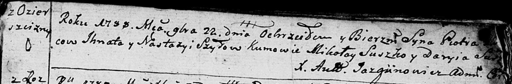
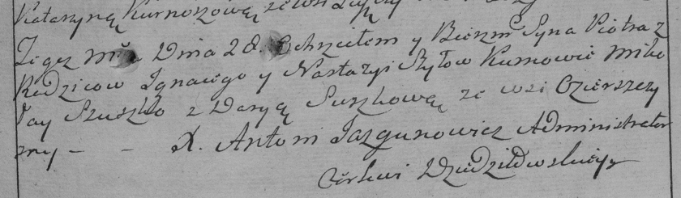

**Шило Пётр Игнатов (Szyło Piotr)**

22 ноября 1788 г -- крещение (НИАБ 136-13-894, лист 6, №65/1788-р
(ориг)), (РГИА 823-2-18, лист 237, №35/1788-р (коп)).

**НИАБ 136-13-894:** Лист 6. **Метрическая запись №65/1788-р (ориг).**

Дедиловичская Покровская церковь. 22 ноября 1788 года. Метрическая
запись о крещении.

Szyło Piotr -- сын родителей с деревни Озерщизна.

Szyło Jhnat -- отец.

Szyłowa Nastazyia -- мать.

Suszko Mikołay - кум.

Suszkowa Daryia - кума.

Jazgunowicz Antoniusz -- ксёндз.

**РГИА 823-2-18:** Лист 237. **Метрическая запись №35/1788-р (коп).**

Дедиловичская Покровская церковь. 28 декабря 1788 года. Метрическая
запись о крещении.

Szyło Piotr -- сын родителей с деревни Озерщизна.

Szyło Jgnacy -- отец.

Szyłowa Nastazya -- мать.

Szuszko Mikołay -- кум.

Suszkowa Darya - кума.

Jazgunowicz Antoni -- ксёндз.
