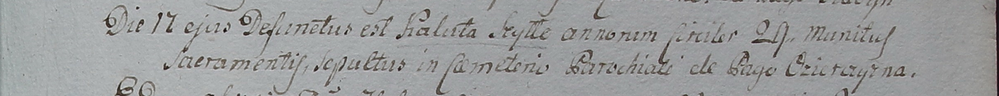

**Шило Калюта (Szyło Kaluta)**

3 февраля 1799 г -- крещение сына Винцентия (НИАБ 1781-27-199, лист 125,
№15/1799-р).

17 сентября 1799 г -- отпевание, умер в возрасте 29 лет (родился около
1770 г) (НИАБ 1781-27-199, лист 131, №15/1799-у).

**НИАБ 1781-27-199:** Лист 125. **Метрическая запись №15/1799-р.**

{width="6.496527777777778in"
height="0.5229166666666667in"}

Дедиловичский костел Наисвятейшего Сердца Иисуса. 3 февраля 1799 года.
Метрическая запись о крещении.

Szyło Vincenti -- сын крестьян с деревни Озерщизна.

Szyło Kaluta -- отец.

Szyłowa Anna -- мать.

Suszko Wasil -- крестный отец.

Bielawska Ulana - крестная мать.

Linhart Hyacinthus -- ксёндз.

**НИАБ 1781-27-199:** Лист 131. **Метрическая запись №15/1799-у.**

{width="6.496527777777778in"
height="0.6298611111111111in"}

Дедиловичский костел Наисвятейшего Сердца Иисуса. 17 сентября 1799 года.
Метрическая запись об отпевании.

Szyłło Kaluta -- умерший, 29 лет, с деревни Озерщизна.

Linhart Hyacinthus -- ксёндз.
