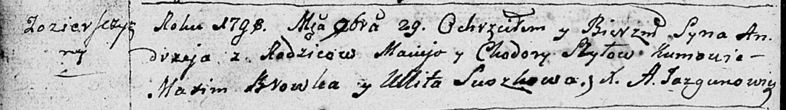
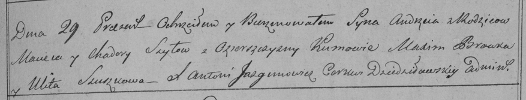

**Шило Андрей Мацеев (Szyło Andrzey)**

29 ноября 1798 г -- крещение (НИАБ 136-13-894, лист 37об, №58/1798-р
(ориг)), (РГИА 823-2-18, лист 267, №59/1798-р (коп)).

**НИАБ 136-13-894:** Лист 37об. **Метрическая запись №58/1798-р
(ориг).**

Дедиловичская Покровская церковь. 29 ноября 1798 года. Метрическая
запись о крещении.

Szyło Andrzey -- сын родителей с деревни Озерщизна.

Szyło Maciey -- отец.

Szyłowa Chodora -- мать.

Browka Maxim - кум.

Suszkowa Ullita - кума.

Jazgunowicz Antoni -- ксёндз.

**РГИА 823-2-18:** Лист 267. **Метрическая запись №59/1798-р (коп).**

Дедиловичская Покровская церковь. 29 ноября 1798 года. Метрическая
запись о крещении.

Szyło Andrzey -- сын родителей с деревни Озерщизна.

Szyło Maciey -- отец.

Szyłowa Chadora -- мать.

Browka Maxim -- кум.

Szuszkowa Ulita -- кума.

Jazgunowicz Antoni -- ксёндз.
