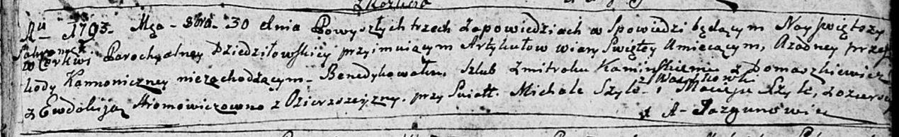

**Шило Мацей (Szyło Maciej, Mathias)**

2 октября 1791 г -- крещение дочери Юстыны (НИАБ 136-13-894, лист 14,
№47/1791-р (ориг)), (РГИА 823-2-18, лист 242, №24/1791-р (коп)).

30 октября 1793 г -- свидетель венчания Каминского Змитрока с деревни
Домашковичи и Евдокии Хромович с деревни Озерщизна (НИАБ 136-13-894,
лист 72, №5/1793-б (ориг)).

18 февраля 1794 г -- крещение сына Леона (НИАБ 136-13-894, лист 21об,
№10/1794-р (ориг)), (РГИА 823-2-18, лист 249, №6/1794-р (коп)).

30 апреля 1796 г -- крещение дочери Настасьи (НИАБ 136-13-894, лист 14,
№40/1796-р (ориг)).

29 ноября 1798 г -- крещение сына Андрея (НИАБ 136-13-894, лист 37об,
№58/1798-р (ориг)), (РГИА 823-2-18, лист 267, №59/1798-р (коп)).

1 декабря 1801 г -- крещение сына Михала (НИАБ 937-4-32, лист 5,
№27/1801-р).

**НИАБ 136-13-894:** Лист 14. **Метрическая запись №47/1791-р (ориг).**

{width="6.496527777777778in"
height="1.2102624671916011in"}

Дедиловичская Покровская церковь. 2 октября 1791 года. Метрическая
запись о крещении.

Szyłowna Justyna -- дочь родителей с деревни Озерщизна.

Szyło Maciej -- отец.

Szyłowa Teodora -- мать.

Browka Paweł - кум.

Szuszkiewiczowa Teodora - кума.

Jazgunowicz Antoni -- ксёндз.

**РГИА 823-2-18:** Лист 243. **Метрическая запись №25/1791-р (коп).**

{width="6.496527777777778in"
height="2.0034722222222223in"}

Дедиловичская Покровская церковь. 2 октября 1791 года. Метрическая
запись о крещении.

Szyłowna Justyna -- дочь родителей с деревни Рудня \[Озерщизна\].

Szyło Maciey -- отец.

Szyłowa Teodora -- мать.

Browka Paweł -- кум.

Suszkewiczowa Teodora - кума.

Jazgunowicz Antoni -- ксёндз.

**НИАБ 136-13-894:** Лист 72. **Метрическая запись №5/1793-б (ориг).**

{width="6.496527777777778in"
height="0.9983825459317586in"}

Дедиловичская Покровская церковь. 30 октября 1793 года. Метрическая
запись о венчании.

Kaminski Zmitrok -- жених, с деревни Домашковичи.

Hromowiczowna Ewdokija -- невеста, с деревни Озерщизна.

Szyło Michał -- свидетель, с деревни Васильковка.

Szyło Maciey -- свидетель, с деревни Озерщизна.

Jazgunowicz Antoni -- ксёндз.

**НИАБ 136-13-894:** Лист 21-об. **Метрическая запись №10/1794-р
(ориг).**

{width="6.496527777777778in"
height="1.1432119422572178in"}

Дедиловичская Покровская церковь. 18 февраля 1794 года. Метрическая
запись о крещении.

Szyło Leon -- сын родителей с деревни Озерщизна.

Szyło Maciey -- отец.

Szyłowa Teodora -- мать.

Browka Maxym - кум.

Suszkowa Ullita - кума.

Jazgunowicz Antoni -- ксёндз.

**РГИА 823-2-18:** Лист 249. **Метрическая запись №6/1794-р (коп).**

{width="6.496527777777778in"
height="1.7506944444444446in"}

Дедиловичская Покровская церковь. 18 февраля 1794 года. Метрическая
запись о крещении.

Szyło Leon -- сын родителей с деревни Озерщизна.

Szyło Maciey -- отец.

Szyłowa Teodora -- мать.

Browka Maxim -- кум.

Suszkowa Ulita -- кума.

Jazgunowicz Antoni -- ксёндз.

**НИАБ 136-13-894:** Лист 29. **Метрическая запись №40/1796-р (ориг).**

{width="6.496527777777778in"
height="0.9212740594925635in"}

Дедиловичская Покровская церковь. 30 апреля 1796 года. Метрическая
запись о крещении.

Szyłowna Nastazyia -- дочь родителей с деревни Озерщизна.

Szyło Maciey -- отец.

Szyłowa Chodora -- мать.

Browka Paweł - кум.

Suszkowa Ullita - кума.

Jazgunowicz Antoni -- ксёндз.

**НИАБ 136-13-894:** Лист 37об. **Метрическая запись №58/1798-р
(ориг).**

{width="6.496527777777778in"
height="0.9112171916010499in"}

Дедиловичская Покровская церковь. 29 ноября 1798 года. Метрическая
запись о крещении.

Szyło Andrzey -- сын родителей с деревни Озерщизна.

Szyło Maciey -- отец.

Szyłowa Chodora -- мать.

Browka Maxim - кум.

Suszkowa Ullita - кума.

Jazgunowicz Antoni -- ксёндз.

**РГИА 823-2-18:** Лист 267. **Метрическая запись №59/1798-р (коп).**

{width="6.496527777777778in"
height="1.2368055555555555in"}

Дедиловичская Покровская церковь. 29 ноября 1798 года. Метрическая
запись о крещении.

Szyło Andrzey -- сын родителей с деревни Озерщизна.

Szyło Maciey -- отец.

Szyłowa Chadora -- мать.

Browka Maxim -- кум.

Szuszkowa Ulita -- кума.

Jazgunowicz Antoni -- ксёндз.

**НИАБ 937-4-32:** Лист 5. **Метрическая запись №27/1801-р.**

{width="6.496527777777778in"
height="0.8541666666666666in"}

Дедиловичский костел Наисвятейшего Сердца Иисуса. 1 декабря 1801 года.
Метрическая запись о крещении.

Szyło Michaelis -- сын крестьян с деревни Озерщизна.

Szyło Mathias -- отец.

Szyłowa Theodora -- мать.

Brouka Paul -- крестный отец.

Suszkowa Ulana? -- крестная мать.

Jazgunowicz Antoniusz -- ксёндз, администратор Дедиловичской униатской
церкви.
